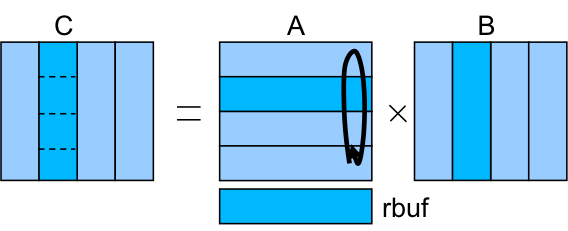

Matrix multiply
---------------

.. highlight:: c

This codes performs a matrix - matrix multiplication by means of  a hybrid MPI/OmpSs implementation.

.. note::
  You can dowload this code visiting the url http://pm.bsc.es *OmpSs Examples and Exercises*'s
  (code) link. This version of matrix multiply kernel is included inside the  *04-mpi+ompss*'s directory.

Groups of rows of the matrix A are distributed to the different MPI processes. Similarly for the
matrix B, groups of columns are distributed to the different MPI process. In each iteration, each
process performs the multiplication of the A rows by the B columns in order to compute a block of C.
After the computation, each process exchanges with its neighbours the set of rows of A (sending the
current ones to the process i+1 and receiving the ones for the next iteration from the process i-1).

An additional buffer rbuf is used to exchange the rows of matrix A between the different iterations.

In this implementation of the code, two tasks are defined: one for the computation of the block of C
and another for the communication. See the sample code snippet::

  for( it = 0; it < nodes; it++ ) {

    #pragma omp task // add in, out and inout
    cblas_dgemm(CblasRowMajor, CblasNoTrans, CblasNoTrans, n, n, m, 1.0, (double *)a, m, (double *)B, n, 1.0, (double *)&C[i][0], n);

    if (it < nodes-1) {
       #pragma omp task // add in, out and inout
       MPI_Sendrecv( a, size, MPI_DOUBLE, down, tag, rbuf, size, MPI_DOUBLE, up, tag, MPI_COMM_WORLD, &stats );
    }

    i = (i+n)%m;                 //next C block circular
    ptmp=a; a=rbuf; rbuf=ptmp;   //swap pointers
  }

The exercise is provided without the in, out and inout dependence clauses.

- Complete the pragmas in order to define the correct dependences
- Compile and run the example and check that the results are correct (the output of the computation
  already checks the correctness)
- Generate the tracefile and task graph of the execution 
